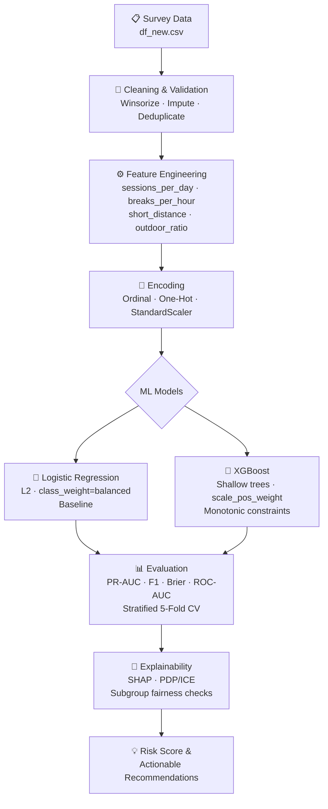

# 👁️ Eye Vision Risk Prediction

<div align="center">

**Can screen habits predict vision risk? We built an ML pipeline to find out.**

[](https://www.python.org/)
[](EyeVisionProject.ipynb)
[](https://xgboost.readthedocs.io/)
[](LICENSE)
[]()

</div>

---

> ⚕️ **Medical Disclaimer:** This is an academic machine-learning prototype for educational use only. It is **not** a medical device and must **not** replace examination by a qualified eye-care professional.

---

## 🔍 What This Project Does

This project investigates whether **self-reported device usage, visual ergonomics, and lifestyle data** can estimate a person's vision-risk severity — before they visit a doctor.

We compare a **Logistic Regression baseline** against an **XGBoost classifier**, apply SHAP explainability, and run rigorous cross-validation to evaluate whether everyday behavioral signals carry predictive signal for eye health risk.

| Task | Type | Classes |
|------|------|---------|
| Task A | Binary classification | `normal` vs. `impaired` |
| Task B | Ordinal classification | `normal` · `mild` · `moderate` · `severe` |

---

## 🗂️ Repository Structure

```
Eye-Vision-prediction-project/
├── EyeVisionProject.ipynb          # Full analysis: EDA → preprocessing → modeling → SHAP
├── df_new.csv                      # Survey dataset (81 rows × 18 columns)
├── requirements.txt                # Python dependencies
├── LICENSE                         # MIT License
└── docs/
    ├── REPORT.md                   # Concise project report & interpretation
    ├── LIMITATIONS_AND_ETHICS.md   # Honest scope, risks, and ethical considerations
    ├── problem-framing-and-related-work.md
    ├── model-design-and-justification.md
    └── data-acquisition-and-preprocessing.md
```

---

## 🔬 ML Pipeline



---

## 📊 Dataset

The dataset contains **81 survey responses** across **18 columns**:

| Category | Features |
|----------|----------|
| **Demographics** | `age`, `gender` |
| **Device usage** | `device_type`, `daily_hours`, `session_length`, `breaks` |
| **Display ergonomics** | `font_size`, `brightness`, `dark_mode`, `viewing_distance`, `screen_height`, `lighting` |
| **Lifestyle & health** | `outdoor_time`, `sleep_quality`, `headache_freq`, `eyestrain_freq`, `milk_consumption_ml` |
| **Label** | `vision_label` *(proxy — heuristically derived)* |

### Target Construction

Because the dataset lacks validated clinical outcomes, the notebook derives an exploratory `vision_status` target using a **risk heuristic** combining:

- 📱 Daily screen hours & session length
- ⏸️ Break frequency  
- 🌳 Outdoor time & viewing distance
- 😴 Sleep quality
- 🤕 Headache & eyestrain frequency

> **These are proxy labels, not clinical measurements.** All results should be treated as exploratory.

---

## ⚡ Quick Start

### 1. Clone & install

```bash
git clone https://github.com/YashShinde39/Eye-Vision-prediction-project.git
cd Eye-Vision-prediction-project

python -m venv .venv
source .venv/bin/activate        # macOS/Linux
# .venv\Scripts\activate         # Windows

pip install --upgrade pip
pip install -r requirements.txt
```

### 2. Run the notebook

```bash
jupyter notebook EyeVisionProject.ipynb
```

Run cells top-to-bottom. The notebook expects `df_new.csv` in the project root.

### 3. Try a custom prediction

After running the notebook end-to-end:

```python
custom_user = {
    "age": 22,
    "gender": "female",
    "device_type": "laptop",
    "daily_hours": 8.0,
    "session_length": 90.0,
    "breaks": 1,
    "font_size": "small",
    "brightness": "high",
    "dark_mode": "no",
    "outdoor_time": 0.5,
    "viewing_distance": 30,
    "screen_height": "below_eye",
    "lighting": "dim",
    "sleep_quality": 2,
    "headache_freq": 4,
    "eyestrain_freq": 4,
    "milk_consumption_ml": 150,
    "vision_label": "moderate",
}

prediction = predict_vision_status_severity(custom_user)
print(prediction["predicted_vision_severity"])
# → 'moderate'
```

---

## 📈 Notebook Walkthrough

| Stage | Description |
|-------|-------------|
| **1. EDA** | Distribution plots, correlation matrix, class balance inspection |
| **2. Target construction** | Heuristic risk scoring → binary & ordinal labels |
| **3. Preprocessing** | Ordinal/one-hot encoding, StandardScaler, feature engineering |
| **4. Modeling** | Logistic Regression & XGBoost training with stratified split |
| **5. Evaluation** | Accuracy, Precision, Recall, F1, ROC-AUC, Brier, confusion matrices |
| **6. Cross-validation** | Stratified 5-fold CV with mean ± std metrics |
| **7. Explainability** | SHAP global importance, PDP/ICE for key features |
| **8. Fairness checks** | Subgroup performance by age, gender, device type |
| **9. Leakage analysis** | Re-train including symptom features to quantify potential circularity |
| **10. Custom prediction** | Interactive function for any user-defined profile |

---

## 🧠 Key Findings

- **Top predictors** (by SHAP magnitude): `daily_hours`, `session_length`, `breaks`, `viewing_distance`, `sleep_quality`
- **XGBoost** outperforms Logistic Regression on PR-AUC and ordinal F1, but gains are modest given the small dataset
- **Symptom features** (`headache_freq`, `eyestrain_freq`) cause substantial score inflation when included — confirming potential label leakage
- **SHAP directions** align with ergonomics literature: more screen time, fewer breaks, and shorter viewing distance all push toward higher risk
- **Actionable levers**: break frequency and outdoor time are among the most modifiable high-importance features

---

## ⚠️ Limitations

- Dataset is very small (n = 81) — metrics are **illustrative, not statistically conclusive**
- Targets are **heuristically derived**, not clinically validated
- Self-reported features are subject to recall and social-desirability bias
- Results may not generalise beyond the study population

See [`docs/LIMITATIONS_AND_ETHICS.md`](docs/LIMITATIONS_AND_ETHICS.md) for a full breakdown.

---

## 📚 Documentation

| Document | Description |
|----------|-------------|
| [`docs/REPORT.md`](docs/REPORT.md) | Concise project summary, methods, and results |
| [`docs/LIMITATIONS_AND_ETHICS.md`](docs/LIMITATIONS_AND_ETHICS.md) | Full scope, risks, fairness, and ethical guidelines |
| [`docs/model-design-and-justification.md`](docs/model-design-and-justification.md) | Model selection, validation strategy, confounder handling |
| [`docs/data-acquisition-and-preprocessing.md`](docs/data-acquisition-and-preprocessing.md) | Dataset schema, cleaning rules, encoding, feature engineering |
| [`docs/problem-framing-and-related-work.md`](docs/problem-framing-and-related-work.md) | Problem context, related literature, ethics, success criteria |

---

## 👥 Team

| Name | Roll Number |
|------|-------------|
| Arpit Raj | BTECH/10780/24 |
| Ayush Marvin Bilung | BTECH/10579/24 |
| Palash Siddharth Mendhe | BTECH/10536/24 |
| Pogula Raja Vardhan Reddy | BTECH/10985/24 |
| Yash Abasaheb Shinde | BTECH/10780/24 |

---

## 📄 License

This project is released under the [MIT License](LICENSE).  
For academic and educational use. Not for clinical or diagnostic use.
